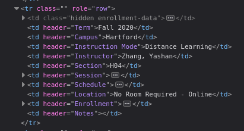
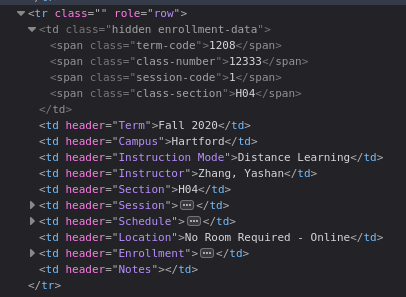

## is-course-open (ICO)

Find refreshing the course catalog as much of a pain in the ass as me? Well oh boy is this the tool for you.

### Prerequisites

In order for ICO to run, the following must be installed:
 - Node.js
   - TypeScript
   - ts-node

### Installation & Usage

Once you have cloned this repository, rename the ``config.default.json`` to ``config.json``, and set it up to your liking. *(Learn more regarding how to do that below.)*

Now, run ``npm install`` to install all of the required packages, and once you have configured ICO, use ``npm start`` to start it. Nothing should show up at first, but don't worry, if you are using the default schedule, it will run every 15 seconds of the minute (0, 15, 30, 45), and won't say anything until it hits that time interval.

### What does it do?

This little app allows you to create a [cron schedule](https://crontab.guru/) on which to poll enrollment information for a given course. All you need to do is supply some relevent course information for ICO to do it's magic.

| Parameter             | What is it                                                                       |
| -----------           | -----------                                                                      |
| ``term``              | what uconn internally identifies the term this course is being taught during as  |
| ``className``         | what ICO should call this course when sending notifications                      |
| ``classNumber``       | what uconn interally identifies this specific course/section                     |
| ``classSection``      | what session of the course this request refers to                                |

### Just a quick heads up

This app is meant to be used in moderation, meaning that you shouldn't be running it every second to retrieve new data as I don't really know how redundent or tolerant the endpoint is, and how it may impact the UConn network. Basically don't be a prick and try to cause a DoS (Denial Of Service) using this tool.. really, please don't.

### So, how do I obtain the above parameter values?

1. Firstly, visit the [UConn Course Catalog](https://catalog.uconn.edu/directory-of-courses/), and find the course you want to keep track of seats.

2. Next, open your browser's DOM inspector. This can typically be done by right clicking anywhere on the page, and then clicking *Inspect Element*.

3. Once the inspector is open, find the *Element Picker* button, which is usually found in the top-left of the inspector window. It will have a tooltip that says something along the lines of "Select an element from the page to inspect it."

4. Now, once you click back to the page, you should see that when you hover over elements on the page, they become highlighted. Scroll down to the specific course entry that you would like to track, and click on any of the boxes for that row.

5. Once you click on it, you should see something like this: 

6. From here, expand the top ``<td>`` element, and you will be able to see the course data. It should look like this: 

7. There are the course parameters you will need to copy over to your configuration file. Now, though, you may be wondering, where is the ``className`` field? Don't worry, this parameter merely exists to tell ICO what to call your desired course, so you may choose whatever you want to put there.

### Configuring SMS Notifications

If you would like to receive SMS notifications once a course opens up, you will need to setup a [Twilio](https://www.twilio.com/sms) account. Once signed up, you should receive ~$15 of trial credit, and considering this app won't be sending too many messages on your behalf, you shouldn't need to worry about how much of said credit it uses up.

Once you have a Twilio account setup, go to the [Twilio Console](https://www.twilio.com/console), and create a virtual phone number. Once done, take that number, your Account SID, and authentication token, and paste them into their respective fields in the configuration file.